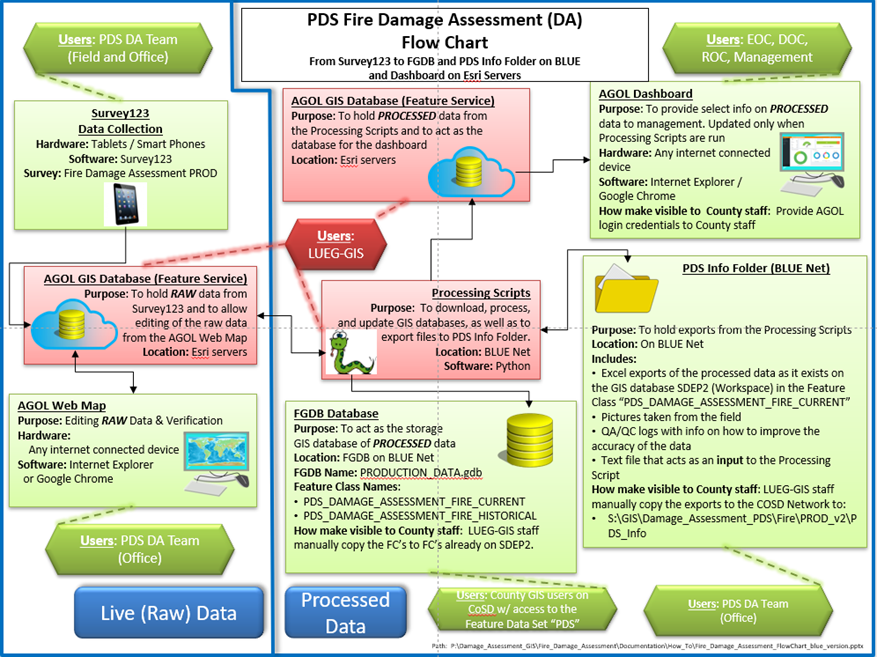

# Fire_Damage_Assessment

For full documentation on the FDA, see "How-To_Fire-Damage-Assessment_EXPLAINED_v-Blue.docx".

Other How To's available for specific tasks including Adding users, using the dashboard, and interacting with the data via Excel.

## Data Flow Chart:

